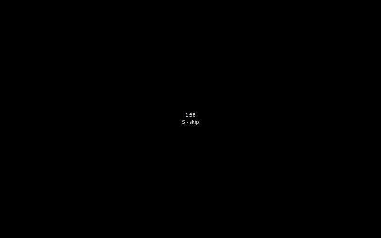

# Screen time limiter tool

Covers screen with black frame after some periods of time.

## Installing

Linux: download appimage from releases page, make it executable and run

Windows and OSX: not implemented (let me know if they are needed)

## Building from source

Like any other Qt app: just type `qmake && make`

To obtain appimage: run `share/ubuntu/build.sh`

## Usage

Edit ini file based on default one and run app with it as argument
(like `screendose -c ./settings.ini`).

App has no main window. Just one tray icon.

Shortcuts:

- `S` - skip current break

## License

This project is licensed under the MIT License - see the LICENSE.md file for details.

## Contributing

Create issue/PR on project's page on github.com.
